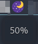

# BrightTray

monitor and control your display brightness from your system tray

- just a lot worse than brightnessctl lol
- this is just a mess, especially when it comes to memory usage idk
- the main gtk features are implemented with deprecated functions lmao

## Features

- shows the current brightness as a tooltip
- change the brightness +/- 10% when scrolling up/down
    - brightness is capped at 10% so your screen doesn't vanish 
- it turns into a moon icon when your brightness is low :)

## Building

- `make clean run` builds the binary and runs it

### Dependencies

- libnotify
- gtk3.0
- systemd(-bus)
- a C compiler obv, duh 

## Credit

not really stealing code just figuring out how everything works in detail (code may look very similar tho lol)

- [https://github.com/Hummer12007/brightnessctl](https://github.com/Hummer12007/brightnessctl) this is such an amazing project
    - i will never be like this person :,)
- [https://github.com/Mango0x45/liblux](https://github.com/Mango0x45/liblux) for implementing my own janky brightness library
- [https://github.com/Maato/volumeicon](https://github.com/Maato/volumeicon) for figuring out how gtk icons works and how real time information updating is done
- [https://github.com/valr/cbatticon](https://github.com/valr/cbatticon) for figuring out how gtk icons works

## TODO

- [ ] option menu on click
- [ ] option for stepsize
- [ ] option to cap brightness at a certain value (currently 10%)
- [ ] make it available for *real init systems*
